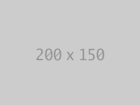
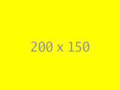
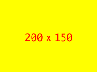
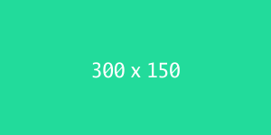

# 
YAS

Yet Another Placeholder Service

YAPS is a server backend which generates placeholder image of any size along with parameters for customization.

## Installation

`go install github.com/cod3rboy/yaps`

## Docker Image

`docker run -d -p 80:8080 --name yaps-server cod3rboy/yaps`

## Project Dependencies

- [go-webpbin](https://pkg.go.dev/github.com/nickalie/go-webpbin) - For webp format encoding.
- [gg](https://github.com/fogleman/gg) - Go graphics library.
- [gofiber](https://github.com/gofiber/fiber/v2) - Web framework for golang.
- [freetype](https://github.com/golang/freetype) - Font rendering library.
- [iniflags](https://github.com/vharitonsky/iniflags) - Library to load flags from ini configuration files.
- [image](https://pkg.go.dev/golang.org/x/image) - Supplementary library to standard `image` package.

## Building Project

`go build .`

## Running Server

`yaps -hostName localhost -hostPort 8080`

## Running Tests

`go test ./... -v`

## Command Line Flags

- `-hostName` - Server host name to use. e.g. `localhost`
- `-hostPort` - Server port number to use. e.g. `8080`
- `-allowMethods` - Comma-separated http methods to allow. e.g. `GET,PUT,PATCH,POST`
- `-allowOrigins` - Commad-separated whitelisted origins. Use `*` to allow all origins. e.g. `example.com,foo.com,bar.com`
- `-config` - Path to ini configuration file.

## Usage Guide

Once the server is up and running (at localhost:8080 for example) then you can send `GET` request to generate and receive placeholder images. The request _path_ determines the image format and _query parameters_ are used to customize image -

| Path  | Image Format |
| ----- | ------------ |
| /png  | PNG Image    |
| /jpg  | JPG Image    |
| /jpeg | JPEG Image   |
| /tiff | TIFF Image   |
| /webp | WEBP Image   |

| Query Parameter | Description                            | Example       |
| --------------- | -------------------------------------- | ------------- |
| s               | Image dimensions (width x height)      | 200x100       |
| b               | Background color in hexadecimal digits | F3FFEA or FA3 |
| c               | Text color in hexadecimal digits       | F3FFEA or FA3 |
| t               | Text to display in the image           | Hello World   |
| x               | Scaling factor for width and height    | 2 or 1.5      |

## Examples

Default image (No query parameters)

Custom size (`?s=200x150`)

Yellow background (`?s=200x150&b=FFFF00`)

Red text (`?s=200x150&b=FFFF00&c=FF0000`)

Custom text (`?s=200x150&b=FFFF00&c=FF0000&t=Hello%20World`)

Scaled image (`?s=200x100&b=22DB9B&c=FFF&x=1.5`)

